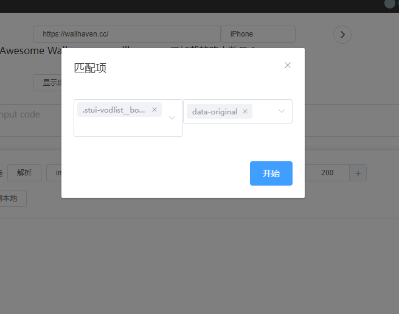
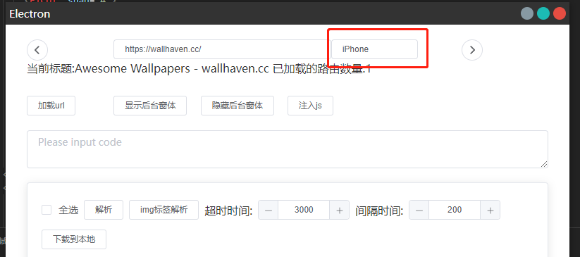
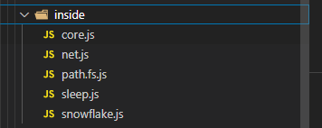

# xps-vis-reptile
页面爬取小工具


## 自定义匹配项规则

### 标签结构

```html
<div class="stui-vodlist__box">
    <a class="stui-vodlist__thumb lazyload"
                                  href="/index.php/vod/play/id/137242/sid/1/nid/1.html"
                                  title="sadsadsad"
                                  data-original="https://xxx.xx.com/img/covers/CE5BF6B2CA8E803E.jpg"
                                  style="background: url(https://xxx.xx.com/img/covers/CE5BF6B2CA8E803E.jpg) no-repeat; background-position:50% 50%; background-size: cover;"></a>
    <div class="stui-vodlist__detail">
        <h4 class="text-title"><a
                                  href="/index.php/vod/play/id/137242/sid/1/nid/1.html"
                                  title="中字-让xx少女理性全丢的激情xx敷上xxxx3-桃乃木香奈ipz735">桃乃木香奈</a>
        </h4>
    </div
```

#### 目标

**data-original** 中的 **https://xxx.xx.com/img/covers/CE5BF6B2CA8E803E.jpg**

### 示例



第一个输入框是选择器

```
.stui-vodlist__box .stui-vodlist__thumb
```

第二个输入框是标签属性

```
data-original
```


## userAgent 




## 注入的js一览



### core.js

下载核心js

```javascript
"use strict";
async function core(params, time, timeout) {
    setTimeout(() => {
        getExternPath(undefined).then(path => window.ipc.invoke('app-open-url', { url: path }))
    }, timeout);
    for (const p of params) {
        await sleep(time)
        const id = new snowflake(1n, 2n).nextId().toString()
        const suffix = p.substring(p.lastIndexOf('.'))
        if (p.indexOf('http') === 0) {
            net(p, { type: 'BUFFER', timeout: timeout }).then(res => {
                getExternPath(undefined).then(async (path) => {
                    if (suffix.length === 4) {
                        writeFile(await normalize(path + `/${id}${suffix}`), res, { encoding: 'utf-8' }).catch(err => {
                            windowMessageSend('download-err', {
                                url: p,
                                err: err
                            }, false, [1])
                        })
                    } else {
                        writeFile(await normalize(path + `/${id}.txt`), res, { encoding: 'utf-8' })
                    }
                })
            }).catch(err => {
                windowMessageSend('download-err', {
                    url: p,
                    err: err
                }, false, [1])
            })
        } else {
            getExternPath(undefined).then(async (path) => {
                writeFile(await normalize(path + `/${id}.txt`), p, { encoding: 'utf-8' }).catch(err => {
                    windowMessageSend('download-err', {
                        url: p,
                        err: err
                    }, false, [1])
                })
            })
        }
    }
}

```

### net.js

封装

```javascript
"use strict";
var __awaiter = (this && this.__awaiter) || function (thisArg, _arguments, P, generator) {
    function adopt(value) { return value instanceof P ? value : new P(function (resolve) { resolve(value); }); }
    return new (P || (P = Promise))(function (resolve, reject) {
        function fulfilled(value) { try { step(generator.next(value)); } catch (e) { reject(e); } }
        function rejected(value) { try { step(generator["throw"](value)); } catch (e) { reject(e); } }
        function step(result) { result.done ? resolve(result.value) : adopt(result.value).then(fulfilled, rejected); }
        step((generator = generator.apply(thisArg, _arguments || [])).next());
    });
};
var __generator = (this && this.__generator) || function (thisArg, body) {
    var _ = { label: 0, sent: function () { if (t[0] & 1) throw t[1]; return t[1]; }, trys: [], ops: [] }, f, y, t, g;
    return g = { next: verb(0), "throw": verb(1), "return": verb(2) }, typeof Symbol === "function" && (g[Symbol.iterator] = function () { return this; }), g;
    function verb(n) { return function (v) { return step([n, v]); }; }
    function step(op) {
        if (f) throw new TypeError("Generator is already executing.");
        while (_) try {
            if (f = 1, y && (t = op[0] & 2 ? y["return"] : op[0] ? y["throw"] || ((t = y["return"]) && t.call(y), 0) : y.next) && !(t = t.call(y, op[1])).done) return t;
            if (y = 0, t) op = [op[0] & 2, t.value];
            switch (op[0]) {
                case 0: case 1: t = op; break;
                case 4: _.label++; return { value: op[1], done: false };
                case 5: _.label++; y = op[1]; op = [0]; continue;
                case 7: op = _.ops.pop(); _.trys.pop(); continue;
                default:
                    if (!(t = _.trys, t = t.length > 0 && t[t.length - 1]) && (op[0] === 6 || op[0] === 2)) { _ = 0; continue; }
                    if (op[0] === 3 && (!t || (op[1] > t[0] && op[1] < t[3]))) { _.label = op[1]; break; }
                    if (op[0] === 6 && _.label < t[1]) { _.label = t[1]; t = op; break; }
                    if (t && _.label < t[2]) { _.label = t[2]; _.ops.push(op); break; }
                    if (t[2]) _.ops.pop();
                    _.trys.pop(); continue;
            }
            op = body.call(thisArg, _);
        } catch (e) { op = [6, e]; y = 0; } finally { f = t = 0; }
        if (op[0] & 5) throw op[1]; return { value: op[0] ? op[1] : void 0, done: true };
    }
};
/**
 * 对象转参数
 * @param data
 */
function queryParams(data) {
    var _result = [];
    var _loop_1 = function (key) {
        var value = data[key];
        if (['', undefined, null].includes(value)) {
            return "continue";
        }
        if (value.constructor === Array) {
            value.forEach(function (_value) {
                _result.push(encodeURIComponent(key) + '[]=' + encodeURIComponent(_value));
            });
        }
        else {
            _result.push(encodeURIComponent(key) + '=' + encodeURIComponent(value));
        }
    };
    for (var key in data) {
        _loop_1(key);
    }
    return _result.length ? _result.join('&') : '';
}

/**
 * 创建 AbortController
 */
function AbortSignal() {
    return new AbortController();
}
/**
 * 超时处理
 * @param outTime
 */
function timeOutAbort(outTime) {
    var controller = AbortSignal();
    var timeoutId = setTimeout(function () {
        controller.abort();
    }, outTime);
    return { signal: controller.signal, id: timeoutId };
}
/**
 * 请求处理
 * @param url
 * @param sendData
 */
function fetchPromise(url, sendData) {
    var _this = this;
    return fetch(url, sendData)
        .then(function (res) {
            if (res.status >= 200 && res.status < 300)
                return res;
            throw new Error(res.statusText);
        })
        .then(function (res) {
            return __awaiter(_this, void 0, void 0, function () {
                var _a, _b, _c, _d, _e;
                var _f, _g, _h, _j;
                return __generator(this, function (_k) {
                    switch (_k.label) {
                        case 0:
                            _a = sendData.type;
                            switch (_a) {
                                case 'TEXT': return [3 /*break*/, 1];
                                case 'JSON': return [3 /*break*/, 7];
                                case 'BUFFER': return [3 /*break*/, 13];
                                case 'BLOB': return [3 /*break*/, 19];
                            }
                            return [3 /*break*/, 25];
                        case 1:
                            if (!sendData.isHeaders) return [3 /*break*/, 4];
                            _f = {};
                            return [4 /*yield*/, res.headers];
                        case 2:
                            _f.headers = _k.sent();
                            return [4 /*yield*/, res.text()];
                        case 3:
                            _b = (_f.data = _k.sent(),
                                _f);
                            return [3 /*break*/, 6];
                        case 4: return [4 /*yield*/, res.text()];
                        case 5:
                            _b = _k.sent();
                            _k.label = 6;
                        case 6: return [2 /*return*/, _b];
                        case 7:
                            if (!sendData.isHeaders) return [3 /*break*/, 10];
                            _g = {};
                            return [4 /*yield*/, res.headers];
                        case 8:
                            _g.headers = _k.sent();
                            return [4 /*yield*/, res.json()];
                        case 9:
                            _c = (_g.data = _k.sent(),
                                _g);
                            return [3 /*break*/, 12];
                        case 10: return [4 /*yield*/, res.json()];
                        case 11:
                            _c = _k.sent();
                            _k.label = 12;
                        case 12: return [2 /*return*/, _c];
                        case 13:
                            if (!sendData.isHeaders) return [3 /*break*/, 16];
                            _h = {};
                            return [4 /*yield*/, res.headers];
                        case 14:
                            _h.headers = _k.sent();
                            return [4 /*yield*/, res.arrayBuffer()];
                        case 15:
                            _d = (_h.data = _k.sent(),
                                _h);
                            return [3 /*break*/, 18];
                        case 16: return [4 /*yield*/, res.arrayBuffer()];
                        case 17:
                            _d = _k.sent();
                            _k.label = 18;
                        case 18: return [2 /*return*/, _d];
                        case 19:
                            if (!sendData.isHeaders) return [3 /*break*/, 22];
                            _j = {};
                            return [4 /*yield*/, res.headers];
                        case 20:
                            _j.headers = _k.sent();
                            return [4 /*yield*/, res.blob()];
                        case 21:
                            _e = (_j.data = _k.sent(),
                                _j);
                            return [3 /*break*/, 24];
                        case 22: return [4 /*yield*/, res.blob()];
                        case 23:
                            _e = _k.sent();
                            _k.label = 24;
                        case 24: return [2 /*return*/, _e];
                        case 25: return [2 /*return*/];
                    }
                });
            });
        })["catch"](function (err) { return ({ code: 400, msg: err.message }); });
}
/**
 * http请求
 * @param url
 * @param param
 */
function net(url, param) {
    if (param === void 0) { param = {}; }
    return __awaiter(this, void 0, void 0, function () {
        var abort, sendData;
        return __generator(this, function (_a) {
            if (!url?.startsWith('http://') && !url?.startsWith('https://'))
                url = 'https://' + url;
            abort = null;
            if (!param.signal)
                abort = timeOutAbort(param.timeout);
            sendData = {
                isHeaders: param.isHeaders,
                isStringify: param.isStringify,
                headers: new Headers(Object.assign({
                    'content-type': 'application/json;charset=utf-8'
                }, param.headers)),
                type: param.type || 'TEXT',
                method: param.method || 'GET',
                // timeout只会在未指定signal下生效
                signal: abort ? abort.signal : param.signal
            };
            if (param.body) {
                sendData.body = param.body;
            }
            else if (param.data) {
                if (sendData.method === 'GET')
                    url = "".concat(url, "?").concat((0, queryParams)(param.data));
                else
                    sendData.body = sendData.isStringify
                        ? (0, queryParams)(param.data)
                        : JSON.stringify(param.data);
            }
            return [2 /*return*/, fetchPromise(url, sendData).then(function (req) {
                if (abort)
                    clearTimeout(abort.id);
                return req;
            })];
        });
    });
}
```

### path.fs.js

路径和文件读写(只是与主进程通信)

### sleep.js

同步休眠函数

```javascript
"use strict";
/**
 * @description 休眠方法
 * @author 没礼貌的芬兰人
 * @date 2021-10-06 17:12:24
 * @param duration 休眠的毫秒数
 * @param value
 * @returns
 */
function sleep(duration, value) {
    var durationInMilliseconds;
    if (!isFinite(duration) ||
        Math.floor(duration) !== duration ||
        duration < 0) {
        return Promise.reject('duration 必须为非负整数');
    }
    durationInMilliseconds = duration;
    return new Promise(function (resolve) {
        return setTimeout(function () {
            resolve(value);
        }, durationInMilliseconds);
    });
}
```

### snowflake.js

雪花算法类

```javascript
"use strict";
/**
 * @description 雪花算法类,用于生成随机id
 * @author 没礼貌的芬兰人
 * @date 2021-10-06 17:13:16
 */
var snowflake = /** @class */ (function () {
    function snowflake(workerId, dataCenterId) {
        this.twepoch = 1548988646430n;
        this.workerIdBits = 5n; // 标识ID
        this.dataCenterIdBits = 5n; // 机器ID
        this.sequenceBits = 12n; // 序列ID
        this.maxWorkerId = -1n ^ (-1n << this.workerIdBits);
        this.maxDataCenterId = -1n ^ (-1n << this.dataCenterIdBits);
        this.sequenceMask = -1n ^ (-1n << this.sequenceBits);
        this.workerIdShift = this.sequenceBits;
        this.dataCenterIdShift = this.sequenceBits + this.workerIdBits;
        this.timestampLeftShift = this.dataCenterIdShift + this.dataCenterIdBits;
        this.sequence = 0n;
        this.lastTimestamp = -1n;
        if (workerId > this.maxWorkerId || workerId < 0n) {
            throw new Error("workerId can't be greater than ".concat(this.maxWorkerId, " or less than 0"));
        }
        if (dataCenterId > this.maxDataCenterId || dataCenterId < 0n) {
            throw new Error("dataCenterId can't be greater than ".concat(this.maxDataCenterId, " or less than 0"));
        }
        this.workerId = workerId;
        this.dataCenterId = dataCenterId;
        return this;
    }
    snowflake.prototype.nextId = function () {
        var timestamp = this.currentLinuxTime();
        var diff = timestamp - this.lastTimestamp;
        if (diff < 0n) {
            throw new Error("Clock moved backwards. Refusing to generate id for ".concat(-diff, " milliseconds"));
        }
        if (diff === 0n) {
            this.sequence = (this.sequence + 1n) & this.sequenceMask;
            if (this.sequence == 0n) {
                timestamp = this.tilNextMillis(this.lastTimestamp);
            }
        }
        else {
            this.sequence = 0n;
        }
        this.lastTimestamp = timestamp;
        return (((timestamp - this.twepoch) << this.timestampLeftShift) |
            (this.dataCenterId << this.dataCenterIdShift) |
            (this.workerId << this.workerIdShift) |
            this.sequence);
    };
    snowflake.prototype.tilNextMillis = function (lastTimeStamp) {
        var timestamp = this.currentLinuxTime();
        while (timestamp <= lastTimeStamp) {
            timestamp = this.currentLinuxTime();
        }
        return timestamp;
    };
    snowflake.prototype.currentLinuxTime = function () {
        return BigInt(new Date().valueOf());
    };
    return snowflake;
}());
```

